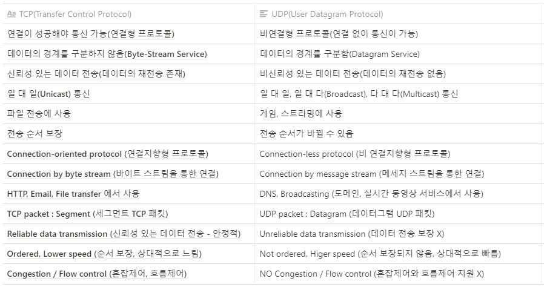

### 링크

- 네트워크 URL
  1. https://mamu2830.blogspot.com/2020/05/url.html

# OSI 7계층

: OSI(Open System Interconnection) 참조 모델은 다른 시스템 간의 원활한 통신을 위해 ISO에서 제정한 통신 규약! -> 특정 시스템에 대한 프로토콜의 의존도를 줄이고 확장성을 높이는 구조

------

1. **물리**

   데이터 단위: bit

- 관련 장비: 리피터, 허브비트를 전기신호로, 전기신호를 비트로 변환하는 기능을 수행
- 주소정보 없음
- 데이터의 종류나 오류를 제어하지 않는다

**2. 데이터링크**

데이터 단위: Frame

스위치에 있는 MAC주소 테이블을 통해 프레임을 전달하는 계층 (MAC주소란 각 기기의 네트워크 카드에 새겨진 고유의 번호)

- 신뢰성 있는 전송을위해 흐름제어, 오류제어, 회선제어를 한다.프로토콜 : Ethernet전송 단위 : Frame
- 관련장비: 랜카드, 브리지, 스위치

**3. 네트워크**

데이터 단위: Packet

- 관련 장비: 라우터보통 인터넷을 신청하면 설치해주는 모뎀이 라우터 역할을 함
- 최종 목적지에 가려면 논리주소(IP)가 필요 -> 여기서 논리 주소 설정해서 전송
- 프로토콜 : IP, ICMP, ARP(IP->MAC), RARP(MAC->IP)

**4. 전송**

- 데이터를 전송하고 전송 속도를 조절하며 오류가 발생한 부분은 다시 맞춰주는 계층

- 종단 시스템간 전송 연결설정(포트이용)

- 프로토콜

  - TCP : 연결지향적, 신뢰성있는 통신을 보장, 데이터의 오류제어와 흐름제어

    데이터 단위: segment

  - UDP : 비연결형 프로토콜, 데이터를 빠르게 전달하는데 초점을 두고 있다. 스티리밍 같이 연속적인 특성을 가지고 있는 서비스에 사용한다.

    데이터 단위: Datagram

**5. 세션**

데이터 단위: Message

- 네트워크상 양쪽연결을 관리하고 논리적인 연결을 말한다.
- 이 계층에서 TCP와 IP 세션을 만들고 없애는 책임을 진다.
- OS가 세션계층에 속해있다.
- 프로토콜: SSH

**6. 표현**

데이터 단위: Message

- 응용 계층,세션 계층의 서로 다른 데이터를 맞게 변환한다.
- 프로토콜: ASCII, MIME
- 형태를 각각에 맞게 변환해 주는 기능(JPEG, GIF, etc..)코드 변환, 데이터 암호화, 데이터 압축 등을 생각하면 된다.

**7. 응용**

데이터 단위: Message

- 브라우저가 포함 됨

- 사용자가 OSI환경에 접근할 수 있도록 서비스 제공(사용자 인터페이스)

- 정보 교환, 파일 전송 등의 서비스

- 프로토콜:

  HTTP

  FTP: 컴퓨터 간 파일을 전송하는데 사용되는 프로토콜

  TELNET: 인터넷이나 로컬 영역 네트워크 연결에 사용

  SMTP: 인터넷에서 이메일을 보내고 받기 이용되는 프로토콜

  DNS: 호스트의 도메인 이름을 네트워크 주소(ip주소)로 바꾸거나 그 반대 수행

  DHCP: 호스트의 IP주소와 각종 TCP/IP 프로토콜의 기본 설정을 클라이언트에게 자동적으로 제공해주는 프로토콜

  POP3: 메일서버에서 내쪽으로 전달의 개념.

  IMAP: 메일서버에 도착한 메일을 사용자의 컴퓨터에서 체크하고, 수신하는 데 필요한

------

# 주소창에 URL을 적었을 때 과정

1. 브라우저의 URL파싱
   - URL 구조 해석
   - 프로토콜, url, 포트 분석
2. HSTS 목록 조회
   - HSTS(HTTP를 허용하지 않고 HTTPS를 사용하는 연결만 허용)목록 조회로 해당 요청을 HTTPS로 보낼지 판단
3. DNS서버를 이용해서 URL을 IP주소로 변환
4. 라우터를 통해 해당 서버의 게이트웨이까지 이동
   - IP주소를 해당 서버로 어떻게 이동할지 라우터를 통해 정한다
5. ARP를 통해 IP주소를 MAC주소로 변환
   - 실질적인 통신을 위해 논리 주소 IP를 MAC주소로 변환
   - ARP, 주소 결정 프로토콜(Address Resolution Protocol): 네트워크 상에서 ip 주소를 물리적 네트워크 주소로 대응 시키기 위해 사용되는 프로토콜
6. 대상 서버와 TCP소켓 연결
   - 소켓 연결은 3-way-handshake과정을 통해 이루워진다. (https로 요청을 보내면 TLS hand shake, 이부분은 https 때 다시 언급)
7. HTTP(HTTPS)프로토콜로 요청, 응답
8. 브라우저에서 응답을 해석

# TCP/UDP

**TCP**

- 연결형 서비스(3-way-handshaking과정으로 연결, 4-way-handshaking으로 해제)

- 흐름제어
  - 데이터 처리 속도를 조절하여 수신자의 버퍼 오버플로우를 방지.
  - 송신하는 곳에서 감당이 안되게 많은 데이터를 빠르게 보내 수신하는 곳에서 문제가 일어나는 것을 막는다.
- 혼잡제어
  - 네트워크 내의 패킷 수가 넘치게 증가하지 않도록 방지
- 신뢰성이 높은 전송
- 전이중 방식(full duplex)
  - 전송이 양방향으로 동시에 가능
- 점대점 방식(Point to Point)
  - 각 연결이 2개의 종단점
- 서버와 클라이언트는 1대1로 연결

**UDP**

- 간단한 데이터를 빠른 속도로 전송하고 하는 애플리케이션에서 사용
- 정보를 주고 받을 때 정보를 보내거나 받는 신호 절차를 거치지 않는다.(비연결형)
- 흐름제어가 없어서 패킷이 제대로 전송되었는지, 오류가 없는지 확인 할 수 없다.(신뢰성낮음)
- 데이터그램 단위로 전송된다.
- UDP 수신자는 데이터를 받는지 안 받는지 관심이 없기 때문에, TCP 헤더보다 적은 양의 정보가 UDP 헤더에 담겨있다.

# IP

- `비연결형` 이며, `패킷 분할/병합` 기능을 갖고 있음
- IP는 데이터를 정확한 위치에 전송해주는 역할을 하지만 `Best-Effort Service` 로서 분실/손상이 발생했을 때 복구하는 기능은 없다.
- 신뢰성이 중요하면 TCP처럼 신뢰성 있는 전송 계층 프로토콜과 함께 사용
- IPv4 / IPv6 : 아직까지도 IPv4를 많이 사용한다.
- 서브네팅 : 서브넷마스크를 통해 네트워크 성능 보장, 자원을 효율적으로 분배하기 위해 네트워크 영역과 호스트 영역을 쪼개는 작업

## JWT

- Json Web Token으로 토큰 기반 인증 방식입니다.
- 서버는 SECRET KEY를 이용해 ACCESS TOKEN을 사용자에 발급하고 사용자는 HTTP요청마다 이를 헤더에 실어 보내게 됩니다. 서버는 SECRET KEY로 복호화한 후, 조작 여부, 유효기간을 확인하여 검증을 하게 됩니다.
- 세션/쿠키는 세션 저장소에 유저의 정보를 넣는 반면 JWT는 토큰 안에 유저의 정보를 넣어 별도의 저장소를 필요로 하지 않는다.
- Access Token을 탈취 당했을 때 보안에 취약하게 되고 이를 보완하기 위해 Refresh Token이 나오게 되었다.
- 일반적으로 클라이언트와 서버, 서비스와 서비스 사이 통신 시 인증을 위해 사용하는 토큰이다.
- 쉽게 전달 될 수 있다.(http헤더에 넣을 수도 있고 URL 파라미터로 전달도 가능하다.)

## HTTP/HTTPS

- HTTP(80번 포트)

  - HTML 문서와 같은 리소스들을 가져오기 위한 프로토콜
  - `비연결성` - 연결을 유지하지 않고 요청에 응답을 하면 연결을 끊음
  - `무상태성` - HTTP에는 이전의 상태정보가 남아있지 않음

- HTTPS(433번 포트)

  - HTTP프로토콜의 보완을 강화하기 위해 SSL프로토콜을 사용하여 데이터를 전송하는 것을 의미

  - 공개키 암호화 방식 사용

  - 모든 사이트가 HTTPS을 사용하지 않는 이유는 암호화 과정으로 인한 속도 저하가 발생하기 때문

  - 통신 과정

    1. 어플리케이션 서버(A)를 만드는 기업은 HTTPS를 적용하기 위해 공개키와 개인키를 만든다.

    2. 신뢰할 수 있는 CA 기업을 선택하고 그 기업에 내 공개키를 관리해달라고 계약하고 돈을 지불한다.

    3. 계약을 완료한 CA 기업은 CA 기업만의 공개키와 개인키가 있다.

       CA기업은 기업의 이름과 A서버의 공개키, 공개키의 암호화 방법 등의 정보를 담은 인증서를 만들고,

       해당 인증서를 CA기업의 개인키로 암호화해서 A서버에 제공한다.

    4. A서버는 암호화된 인증서를 가지게 되고 A서버에 Request가 오면 클라이언트에게 인증서를 줍니다.

    5. 클라이언트 입장에서는 A서버의 정보를 CA 기업의 개인키로 암호화한 인증서를 받게 됩니다.

    6. CA 기업의 공개키는 브라우저는 알고 있다.

    7. 브라우저는 CA 기업 리스트를 쭉 탐색해서 공개키로 인증서를 해독하여 A서버의 공개키를 얻습니다.

    8. A서버의 공개키로 암호화해서 Request를 날리게 된다.

## CORS

- 추가적인 HTTP 헤더를 사용해서 애플리케이션이 다른 Origin의 리소스에 접근할 수 있도록 하는 매커니즘을 말한다. 하지만 다른 Origin에서 내 리소스에 함부로 접근하지 못하게 하기 위해 사용된다.
- Origin(출처): 프로토콜을 포함한 도메인(포트 번호까지 포함)
- 악의를 가진 사용자가 소스 코드를 쓰윽 구경한 후 [CSRF(Cross-Site Request Forgery)](https://ko.wikipedia.org/wiki/사이트_간_요청_위조)나 [XSS(Cross-Site Scripting)](https://ko.wikipedia.org/wiki/사이트_간_스크립팅)와 같은 방법을 사용하여 여러분의 어플리케이션에서 코드가 실행된 것처럼 꾸며서 사용자의 정보를 탈취하기가 너무나도 쉬워지기 때문에 CORS를 사용한다.
- CORS 과정
  1. 기본적으로 웹은 다른 출처의 리소스를 요청할 때는 HTTP 프로토콜을 사용하여 요청을 하는데, 이때 브라우저는 요청 헤더 (request header)에 **`Origin`** 필드에 요청을 보내는 출처를 담아 전송한다.
  2. 서버는 요청에 대한 응답을 하는데, 응답 헤더 (response header)에 **`Access-Control-Allow-Origin`**이라는 값에 '이 리소스를 접근하는 것이 허용된 출처'를 내려준다.
  3. 응답을 받은 브라우저는 자신이 보냈던 요청의 Origin과 서버가 보내준 응답의 **`Access-Control-Allow-Origin`**을 비교해 본 후 이 응답이 유효한 응답인지 아닌지를 결정한다.

## 쿠키/세션

- HTTP 프로토콜 특징
- 서버에서 클라이언트가 누구인지 확인하는 방법
- `연결성`, `무상태성`을 해결
- 로그인을 하게 되면 페이지를 이동하더라도 로그인이 유지되는 것은 쿠키와 세션을 사용했기 때문이다.
- 쿠키 : 클라이언트(로컬)에 저장된 키/값이 있는 데이터 파일 - 유효 시간이 있으며 그 기간 동안 브라우저 종료되어도 유지된다.
  - 다른 사용자가 HTTP요청을 가로채고 훔친 쿠키를 이용할 수 있는데 이를 세션하이재킹 공격이라 하며 HTTPS를 통해 안의 정보를 읽기 힘들게 하거나 세션에 유효시간을 넣어둠으로써 해결할 수 있습니다.
  - 쿠키의 동작 방식
- 세션 : 쿠키와 비슷하지만, 사용자 정보를 서버 측에서 관리한다. (보안성) - 클라이언트마다 세션ID 부여해서 인증 상태 유지
  - 세션의 동작 방식

## 로드밸런싱

- 여러 대의 서버를 두고 서비스를 제공하는 분산 처리 시스템 필수 기술
- 클라이언트의 수가 늘어 기존 서버만으로 정상적인 서비스가 불가능해지면 Scale up(서버 자체의 성능을 높임)이나 Scale out(여러 대의 서버를 둠)을 통해 대처할 수 있다. 이 중 Scale-out 방식에는 로드밸런싱이 필요하다
- OSI 계층마다 사용할 수 있는 로드밸런서가 있다. (L4, L7 등등)
- 로드 밸런싱 알고리즘
  1. 라운드로빈 서버에 들어온 요청을 순서대로 돌아가며 배정하는 방식 서버와의 연결이 오래 지속되지 않는 경우 적합하다.
  2. 가중 라운드로빈 방식 각 서버에 가중치를 매기고 가중치가 높은 서버에 요청을 우선적으로 배정하는 방식 서버의 트래픽 처리 능력이 다른 경우 사용한다.
  3. 최소 연결 방식 요청이 들어온 시점에 가장 적은 연결 상태를 보이는 서버에 트래픽을 배정하는 방식. 서버에 분배된 트래픽들이 일정하지 않은 경우에 적합하다.
  4. IP 해시 방식 클라이언트의 IP주소를 특정 서버로 매핑하여 요청을 처리하는 방식 사용자가 항상 동일한 서버로 연결된다.

## 웹소켓(*)

- HTTP 프로토콜은 매 요청과 응답마다 연결을 수립하고 끊는 과정을 반복해야했기 때문에 이러한 실시간 통신의 문제를 해결하기 위해 웹소켓이 등장했다.
- 웹소켓은 웹서버와 웹 브라우저가 지속적으로 연결된 TCP 라인을 통해 실시간으로 데이터를 주고 받을 수 있도록 하는 HTML5의 새로운 사양이다.
- OSI 모델의 제 7계층에 위치하며 제 4계층의 TCP에 의존한다.
- 웹소켓 이전의 양방향 통신 방법
  1. Polling 방식
     - 클라이언트가 서버에 HTTP 요청을 주기적으로 요청하고 서버가 응답하는 방식
     - 오버헤드가 크다
  2. Long Polling 방식
     - 클라이언트가 서버에 HTTP 요청을 하면 서버는 대기하고 있다가 이벤트가 발생했을 때 응답하는 방식
  3. Streaming 방식
     - Polling, Long Polling처럼 커낵션을 연결하고 끊는 과정 없이 필요한 메세지를 계속 전달한다.
- 웹소켓 연결은 HTTP 프로토콜을 통해 이루어진다.
- 웹소켓은 stateful protocol 이기 때문에 클라이언트와 한번 연결되면 계속 연결을 유지하며 오버헤드가 매우 작다.
- 웹소켓은 서버와 클라이언트 간에 Socket Connections을 유지해서 양방향 통신을 가능하도록 하는 기술로 Real-time web application구현을 위해 사용되어지고 있다. (SNS, 게임, 구글 DOC, 증권거래 등)
- 웹소켄 통신 과정
  1. 클라이언트와 서버간에 전이중 통신을 수행하려면 클라이언트가 서버로 HTTP UPGRADE 요청을 보내야 한다. 이를 웹 소켓 프로토콜 핸드 쉐이크라고한다.
  2. 서버가 커넥션을 UPGRADE 할 수 있는 경우,  HTTP 101 응답을 클라이언트에게 보낸다. 서버는 핸드 쉐이크가 성공적으로 수행되었다고 판단하고,서버와 클라이언트 사이의 커넥션을 웹 소켓 프로토콜로 UPGRADE 한다. 클라이언트와 서버 사이의 HTTP 101 응답이 전달되는 순간, 서버와 클라이언트 사이의 커넥션은 HTTP 프로토콜이라고 하지 않는다. 그리고 이순간 양방향 통신이 가능해진다.
  3. 웹 소켓으로 연결된 모든 클라이언트는 다른 클라이언트에게 커넥션을 끊는 요청을 전송할 수 있다.
