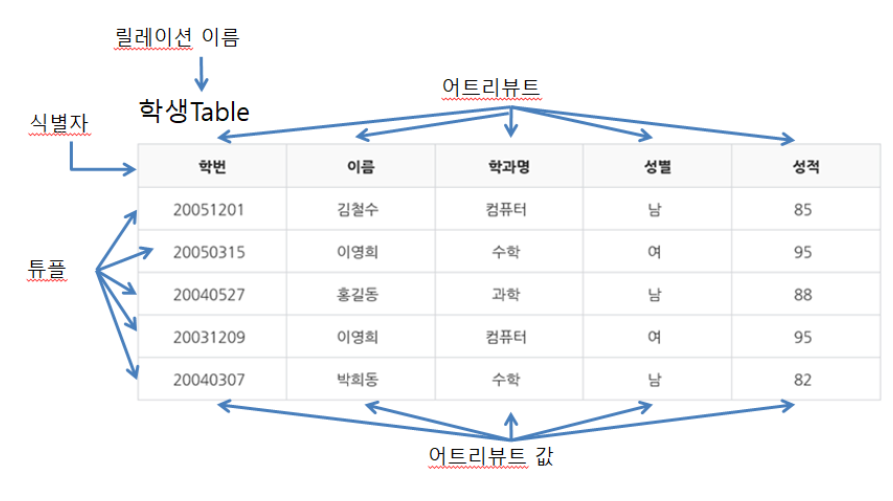

### DML, DDL, DCL, TCL

- DDL(Data Definition Language)

  데이터를 정의하는 언어, '데이터를 담는 그릇을 정의하는 언어'

  DDL 대상 : 도메인, 스키마, 테이블, 뷰, 인덱스

  - 도메인 : 하나의 속성이 가질 수 있는 원자값들의 집합
  - 스키마 : 데이터베이스의 구조, 제약조건 등의 정보를 담고 있는 기본적인 구조
  - 테이블 : 데이터 저장 공간
  - 뷰 : 하나 이상의 테이블에서 유도되는 가상의 테이블
  - 인덱스 : 검색을 빠르게 하기 위한 구조

  명령어

  - CREATE, ALTER,  DROP, TRUNCATE(안에 있는 내용을 삭제)
  - IN VIEW : AS 이후에 조회쿼리
  - IN INDEX : CREATE INDEX 칼럼명 ON 테이블명;

- DML

  데이터베이스에 저장된 자료들을 입력, 수정, 삭제, 조회하는 언어이다

  명령어

  - SELECT, INSERT, UPDATE, DELETE
  - JOIN : 두개 이상의 테이블을 연결하여 데이터를 검색하는 방법
    - 내부, 외부, 교차, 셀프 조인

- DCL

  데이터 제어어, 데이터베이스 관리자가 데이터 보안, 무결성, 유지, 병행 제어, 회복을 위해 관리자가 사용하는 제어용 언어이다.

  명령어

  - GRANT, REVOKE
  - EX. GRANT 권한 ON 테이블명 TO 사용자;

  

### DataBase란

> 데이터베이스는 여러 사람이 공유하여 사용할 목적으로 체계화해 통합, 관리하는 데이터의 집합이다.

###### 

### 기본키, 대체키, 외래키

- 후보키

  릴레이션을 구성하는 속성 중 튜플을 유일하게 식별하기 위한 속성들의 부분집합을 말한다.

  유일성, 최소성을 만족해야한다.

- 기본키

  후보키 중 선정된 주키

  null 값을 가질 수 없다.

- 대체키

  기본키를 제외한 후보키

- 슈퍼키

  유일성은 만족하지만 최소성을 만족하지 않는 속성의 부분집합

- 외래키

  다른 릴레이션의 기본키를 참조하는 속성, 속성의 집합 / 참조하는 릴레이션에서 기본키랑 같은 속성

### SQL, NoSQL 차이

- nosql은 전통 RDBMS와 다른 DBMS를 지칭하기 위한 용어이다.
- 고정된 테이블 스키마가 필요하지 않고 조인 연산을 사용할 수 없으며, 수평적으로 확장이 가능한 DBMS이다.

## **정규화 비정규화**

1. 정규화

   > 중복을 최소화하도록 설계된 데이터베이스

   - 저장 공간의 최소화
   - 데이터의 안정성 및 무결성 유지
   - JOIN연산이 많아져 질의에 대한 응답시간이 느려질 수 있음

2. 비정규화

   > 읽는 시간을 최적화하도록 설계된 데이터베이스

   - JOIN연산의 비용을 줄일 수 있음(데이터 조회가 빠름)
   - 쿼리가 간단해짐
   - 데이터 무결성이 깨질 수 있음
   - 중복된 정보로 인한 이상 현상(Anomaly)이 발생함
     - 삽입 이상: 원하지않는 자료가 삽입됨
     - 삭제 이상: 유지돼야하는 정보까지 삭제됨
     - 갱신 이상: 일부의 튜플만 갱신되어 일관성이 사라짐

3. 규모 확장성(scalability)을 요구하는 시스템의 경우 거의 항상 정규화된 데이터베이스와 비정규화된 데이터베이스를 섞어 사용함

- 참고 : https://mangkyu.tistory.com/110

## **인덱스**

> 추가적인 쓰기 작업과 저장 공간을 활용하여 데이터베이스 테이블의 검색 속도를 향상시키기 위한 자료구조

**장점**

- 테이블을 조회하는 속도와 그에 따른 성능을 향상시킬 수 있다.
- 전반적인 시스템의 부하를 줄일 수 있다.

**단점**

- 인덱스를 관리하기 위해 DB의 약 10%에 해당하는 저장공간이 필요하다.
- 인덱스를 관리하기 위해 추가 작업이 필요하다.
  - INSERT: 새로운 데이터에 대한 인덱스를 추가함
  - DELETE: 삭제하는 데이터의 인덱스를 사용하지 않는다는 작업을 진행함
  - UPDATE: 기존의 인덱스를 사용하지 않음 처리하고, 갱신된 데이터에 대해 인덱스를 추가함
- 인덱스를 잘못 사용할 경우 오히려 성능이 저하되는 역효과가 발생할 수 있다.

### **구현**

- 해시 테이블
  - 빠른 데이터 검색이 필요할 때 유용함
  - 해시는 등호 연산에만 특화돼있음
  - 부등호 연산이 자주 사용되는 검색에는 적합하지 않음
  - 시간복잡도 : 1
- B+ Tree (일반적으로 쓰임)
  - 자식 노드가 2개 이상인 B-Tree를 개선시킨 자료구조
  - 시간복잡도 : logN

## **데이터베이스 무결성**

- 범위(Domain) 무결성
  - 컬럼에 적절한 형식의 데이터가 저장되어있는지를 확인.
- 개체(Entity) 무결성
  - 모든 테이블이 기본 키(primary key)를 가져야 합니다.
- 참조(Referential) 무결성
  - 외래키 값은 NULL이거나 참조 테이블의 primary key여야 함
  - 두 테이블의 데이터가 항상 일관된 값을 갖도록 유지되야 함

## 트랜잭션

> 하나의 논리적인 작업 단위를 구성하는 연산들의 집합.

- ACID property특성
  - 원자성 : 트랜잭션 실행 도중에 문제가 발생했을 경우, 중단된 상태가 아닌 모두 실패하거나, 모두 완성 둘 중 하나의 상태가 되어야 한다.
  - 일관성 : 트랜잭션 완료 후에도 데이터베이스가 일관된 상태로 유지되어야 한다.
  - 고립성 : 하나의 트랜잭션이 실행하는 도중에 변경한 데이터는 이 트렌잭션이 완료될 때까지 다른 트랜잭션이 참조하지 못하게 한다.
  - 지속성 : 트랜잭션이 완료되면 주기억장치가 아닌 디스크와 같은 보조기억장치에 저장되거나 그렇지 않더라도 시스템 장애가 회복되고 난 후에 어떠한 형태로든지 그 데이터를 복구할 수 있게 한다.
- 트랜잭션의 상태
  - Active(활동) : 트랜잭션이 실행 중에 있는 상태, 연산들이 정상적으로 실행 중인 상태
  - Failed(장애) : 트랜잭션이 실행에 오류가 발생하여 중단된 상태
  - Aborted(철회) : 트랜잭션이 비정상적으로 종료되어 Rollback 연산을 수행한 상태
  - Parially Committed(부분 완료) : 트랜잭션이 마지막 연산까지 실행했지만 Commit연산이 실행되기 직전의 상태
  - Committed(완료) : 트랜잭션이 성공적으로 종료되어 Commit연산을 실행한 후의 상태

# ORACLE과 MYSQL의 비교

1. NULL 값 확인 함수

   - ORACLE : NVL함수
   - MySQL : IFNULL

2. 현재 날짜 시간 확인

   - ORACLE : SYSDATE
   - MySQL : NOW()

3. 날짜 포맷 변환

   - ORACLE : TO_CHAR(날짜)
   - MySQL : DATE_FORMAT(날짜)

4. 요일 변환의 숫자 범위

   - ORACLE : 일,월,화,수,목,금,토 → 1,2,3,4,5,6,7
   - MySQL : 일,월,화,수,목,금,토 → 0,1,2,3,4,5,6

5. 문자와 문자 합치는 방법

   - ORACLE : ||
   - MySQL : CONCAT()

6. 형변환

   - ORACLE : TO_NUM, TO_CHAR
   - MySQL : CAST

7. 페이징처리

   - ORACLE : ROWNUM + BETWEEN

     ex)  SELECT * FROM ( SELECT ROWNUM , A.* FROM (SELECT * FROM KGON) A )WHERE ROWNUM BETWEEN 0 AND 10

   - MySQL : LIMIT

8. 시퀀스사용시 다음번호 불러오는 방법

   - ORACLE : 시퀀스명.NEXTVAL
   - MySQL : 시퀀스명.CURRVAL

9. 오라클과 MySQL의 차이

   - Oracle이 MySQL보다 좋음
   - 오라클 : 대규모 트랜잭션 로드를 처리하고, 성능 최적화를 위해 여러 서버에 대용량 DB를 분산함
   - MySQL : 단일 데이터베이스로 제한되어있고, 대용량 데이터베이스로는 부적합. 작은 프로젝트에서 적용시키기 용이하며 이전 상태를 복원하는데 commit과 rollback만 존재

## 트리거(Trigger)

- 특정 테이블에 삽입, 수정, 삭제 등의 **데이터 변경 이벤트**가 발생하면 DBMS에서 **자동적으로 실행**되도록 구현된 프로그램이다.
- 이벤트는 전체 트랜잭션 대상과 각행에 의해 발생되는 경우 모두를 포함할 수 있으며 **테이블과 뷰(View), DB 작업**을 **대상**으로 정의할 수 있다.

### 목적

- 특정 테이블에 대한 데이터 변경을 시작점으로 설정하고, 그와 관련된 작업을 자동적으로 수행하기 위해 트리거를 사용한다.
- 일반적으로 이벤트와 관련된 테이블의 데이터 삽입, 추가, 삭제 작업을 DBMS가 자동적으로 실행시키는데 활용한다.
